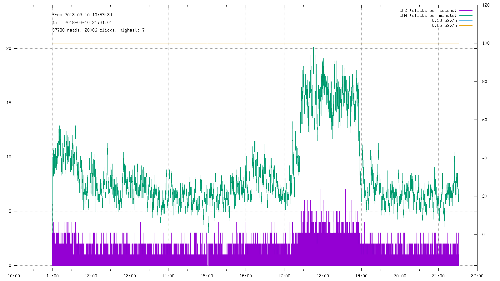

## Description

Dumps the internal buffer of a [GQ GMC-3xx](https://www.gqelectronicsllc.com) Geiger-Müller counter data logger and feeds it to [gnuplot](http://gnuplot.info) to save a PNG graph image.

Use case: going out bicycling while collecting timestamped radiation data; once home, connect the unit to the USB for charging and plotting the collected data.

## Technical details

GQ GMC loggers have some non-volatile internal memory (64k on a GMC-300E+, equivalent to about ~1017 minutes continuous logging) and show a 57600-baud USB-to-serial interface. The internal memory is organized as a circular buffer stream of CPM (clicks-per-minute) readings interspersed with restart timestamps, so it has to be fully scanned to associate data chunks to their actual timestamp (also wiping ount wrecked records because of some firmware bug still present in the 4.21 version), thus it will take about 35 seconds for a 64k buffer. A data record is a single clicks-per-second byte (CPM is the total clicks in a minute).

By default the script ignores data with a timestamp older than current day (if you want to collect everything just use the *alldata* parameter on command-line). The output is directly fed to *gnuplot* along with commands to save the resulting graph to a PNG file (currently */tmp/gmc.png* - see configuration options at the start of the script). The Ruby script waits until the GMC-3xx serial port is available, allowing you to automatically download/graph/post data as soon as you attach the USB cable to charge the internal battery.

The script currently deals with CPS/CPM (clicks-per-second, lower part of the graph, and clicks-per-minute, the continuous line) instead of [microSieverts/hour](https://en.wikipedia.org/wiki/Sievert). It has been tested with a GQ GMC-300E-Plus (both high-mileage and just factory-reset). The script does not depend on the GMC-3xx settings except one: in the *SaveData* menu, the *SaveMode* option should be set to *EverySecond* (it's the default on a factory-reset GMC 300E+).

Output example:

